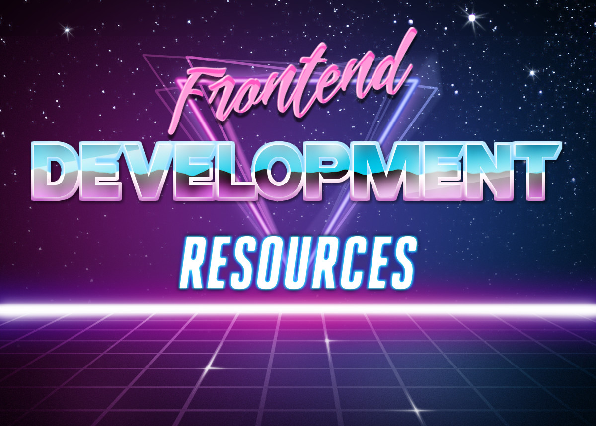

# :cake: Frontend Development Resources

Resources for frontend developers to learn, improve, and grow. Programming paradigms recommended for modern web development. Useful tools and software.

You can learn by reading, watching, or doing with the resources below.

## :memo: Articles

1. **The Pillars of Javascript I & II** (https://medium.com/javascript-scene/the-two-pillars-of-javascript-pt-2-functional-programming-a63aa53a41a4)
2. **Atomic Design by Brad Frost Chapter 2** (https://atomicdesign.bradfrost.com/chapter-2/)
3. **Javascript To Know For React** (https://kentcdodds.com/blog/javascript-to-know-for-react) - Not just for React, but useful crash course in the most useful features in modern JS.
4. **An introduction to functional programming in JavaScript** (https://opensource.com/article/17/6/functional-javascript) - Longer article giving a crash course in functional programming style, which modern JS/frameworks is gravitating towards.
5. **Thinking in React** (https://reactjs.org/docs/thinking-in-react.html) - From the React docs, but a good general workflow for web apps and a way to think about how plan building your application.
6. **Composition vs Inheritance** (https://reactjs.org/docs/composition-vs-inheritance.html) - From the React docs, but a powerful pattern you can use in any framework or kind of code. Composability is all about making things more reusable and modular, like legos. Why follow composition patterns? [Here's a nice explanation and example using a real layout's React code.](https://epicreact.dev/one-react-mistake-thats-slowing-you-down/)
7. **A Complete Guide to Grid** (https://css-tricks.com/snippets/css/complete-guide-grid/) - One of the most useful features in modern CSS, `display: grid` makes layout way easier. Also, here's a [bonus article one some very tricky ways grid sometimes behaves in unexpected ways](https://daverupert.com/2017/09/breaking-the-grid/).
8. **Clean Code Javascript** (https://github.com/ryanmcdermott/clean-code-javascript#introduction) - Learning how to write clean, understandable, and maintainable code is important when working in teams or by yourself. If it's easier to read, it's easier to make changes and easier to come back to. This is a good example filled resource of general JS practices to follow for writing professional code.
9. **How to Test React Components: The Complete Guide** (https://www.freecodecamp.org/news/testing-react-hooks/) - Longish article, but nicely distilled tutorial covering all the basics of a confusing subject: implemnting testing into a React project. Many good resource links at the end.

## :tv: Video

1. **Part 1 of Functional Programming in JavaScript** (https://www.youtube.com/watch?v=BMUiFMZr7vk&list=PL0zVEGEvSaeEd9hlmCXrk5yUyqUag-n84) - First in a 12 video series on all the essential knowledge of functional programming style in JS, good if videos > articles for your learning style.
2. **CSS Grid Changes Everything (About Web Layouts)** (https://www.youtube.com/watch?v=txZq7Laz7_4) - Video presentation on the power of CSS Grid, how it differs from older layout properties, and how to use. A powerful layout tool in modern CSS.

## :game_die: Interactive

1. **Practical Introduction to Functional Programming with JS** (https://www.codingame.com/playgrounds/2980/practical-introduction-to-functional-programming-with-js/) - Interactive tool with in browser live coding exercises and explanations to teach the basics of functional style in JS.
2. **CSS Diner** (https://flukeout.github.io/) - Interactive game/training tool that teaches you almost all the CSS selectors you'll ever need.
3. **Version Control with Git** (https://www.udacity.com/course/version-control-with-git--ud123) - Free online course with interactive exercises using real repositories and quizzes to teach you the essentials of Git.
4. **Code Sandbox** (https://codesandbox.io/) - In browser code editor that lets you edit and share code snippets like jsbin, but with extra features letting you prototype code in all the most popular frontend frameworks--React, Vue, Angular, etc.
5. **Browser Rendering Optimization** (https://www.udacity.com/course/browser-rendering-optimization--ud860) - Free online course with interactive challenges, video, & quizzes teaching you the basics of making your single page web app faster/more performant, using dev tools to diagnose problems, best practices, and common sources of slowdown. Although JS is not often the bottleneck in your code and 99% of the time you want to write for clarity/maintainability, it's useful to have a resource for optimizing your JavaScript if it is the source of slow down. [This article is a great guide on optimizing JS code efficiency.](https://www.smashingmagazine.com/2012/11/writing-fast-memory-efficient-javascript/)

## :computer: Software

1. **Visual Studio Code** (https://code.visualstudio.com/) - Free feature rich IDE that is excellent for web development with many extensions available. Integrated terminal window, keyboard shortcuts, and code navigation tools increase productivity.
2. **Atom** (https://atom.io/) - Another free modern full featured IDE for web development with many plugins available.
3. **Oh My Zsh** (https://ohmyz.sh/) - Makes your terminal look super spiffy and way more usable, with git shortcuts included out of the box. Many themes available. Mac/Linux only, though it is possible to use on Windows if you enable WSL [(Windows Subsystem for Linux)](https://docs.microsoft.com/en-us/windows/wsl/install-win10).
4. **React Developer Tools** (https://chrome.google.com/webstore/detail/react-developer-tools/fmkadmapgofadopljbjfkapdkoienihi?hl=en) - Available for Chrome and Firefox, useful browser extension that adds another tab to your browser Dev Tools specifically focused on your React app component structure/state
